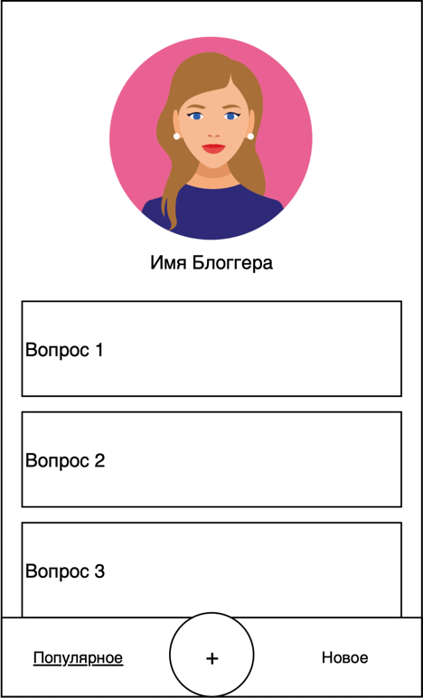

# Репозиторий домашних заданий курса OTUS "Kotlin Backend Developer. Professional"

Учебный проект курса [Kotlin Backend Developer](https://otus.ru/lessons/kotlin/?int_source=courses_catalog&int_term=programming).
Поток курса 2023-04.

kAsk - это для инфлюенсеров, который позволяет хранить и структурировать ответы на часто задаваемые вопросы и взаимодействовать
с аудиторией.

## Макет мобильного приложения

## Маркетинг

1. [Заинтересованные лица](./docs/stakeholders.md)
2. [Целевая аудитория](./docs/target-audience.md)
3. [Конкурентный анализ](./docs/concurrency.md)
4. [Анализ экономики](./docs/economy.md)
5. [Пользовательские истории](./docs/user-stories.md)

## Документация

- [Схема инфраструктуры](./docs/infrastruture.md)
